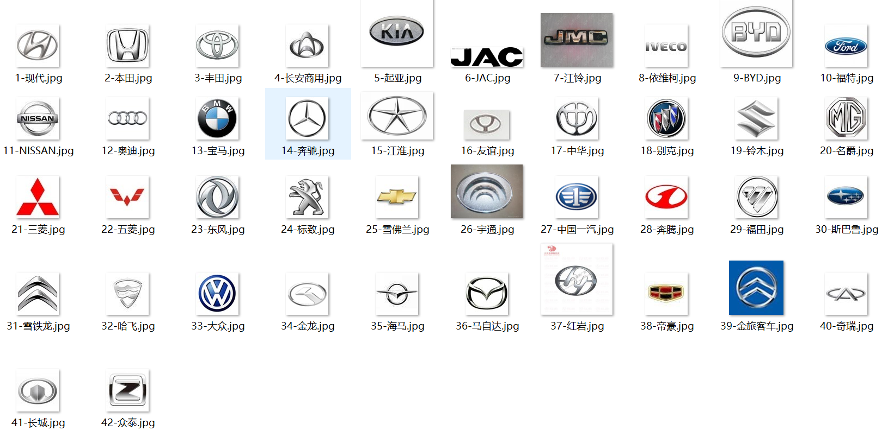

# Vehicle Logos Recognition

### Overview

Classify 42 vehicle logos with different CNN models

### dataset

We explore different models with Keras to do this job. Our dataset is about 25,000 and divided about 8:2 into training and validation dataset. Each image is resized to 64x64, so we change most models to fit our data which is originally designed for 224x224 image size.

### models

- [cifar10](./cifar10) A simple CNN model with just 4 Conv layers and relative few filters of kernel, achieves about 96% accuracy in val.
- [AlexNet](./AlexNet) Classic AlexNet model with smaller first-layer kernel size and stride, achieves about 97.4% accuracy in val.
- [VggNet](./VggNet) Classic VggNet16 model without last block, achieves state-of-the-art about 98.5% accuracy in val.
- [ResNet](./ResNet) Classic ResNet model of new improved version, but performs not very well in this task with only 92% accuracy in val. We are trying to find results.

All the above networks are equiped with [Batch Normalization](https://arxiv.org/abs/1502.03167), which is a effective method that helps the neural network converge quickly and achieve relative good results in just few epochs.

### The original articles
- AlexNet [ImageNet Classification with Deep Convolutional Neural Networks](https://papers.nips.cc/paper/4824-imagenet-classification-with-deep-convolutional-neural-networks)
- VggNet [Very Deep Convolutional Networks for Large-Scale Image Recognition](https://arxiv.org/pdf/1409.1556.pdf)
- ResNet [Deep Residual Learning for Image Recognition](https://arxiv.org/abs/1512.03385)
