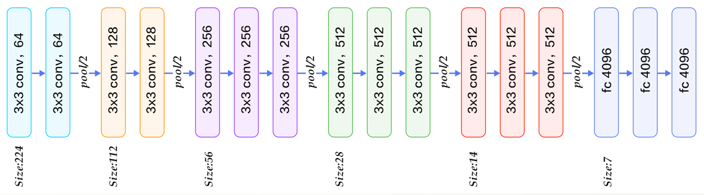

# Vgg16 Net

### The original article
- [Very Deep Convolutional Networks for Large-Scale Image Recognition](https://arxiv.org/pdf/1409.1556.pdf)

All the kernel size of VggNet are **3x3** which fits arbitray image size. Considered the model complexity and last conv layer size, we **discard the last conv block** so the model finally has 13 layers. This model achieves the state-of-the-art **98.5%** accuracy with 581s/epoch. (Because of the memory limit, we set the batch size 64 while the cifar10 and alexnet with 128)

