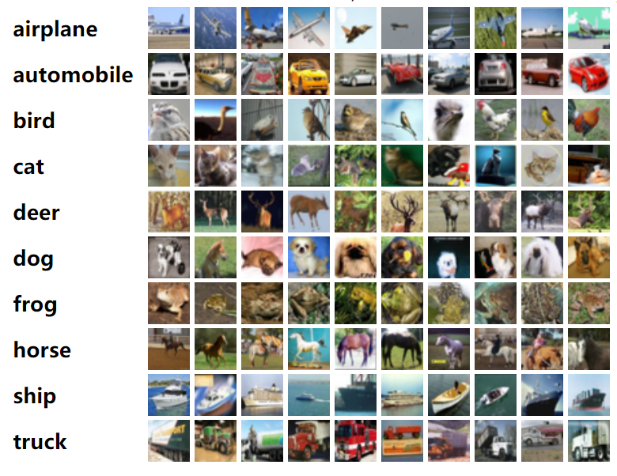

# Cifar-10 Model

A classic model which is originally designed for the CIFAR10 small images dataset.

This model has **four** convolution layers and two fully-connected layers. Each conv kernel is **3x3** and each conv layer has only **32** or **64** filters. This simple architecture achieves about **96%** accuracy which is quite good considered its size.

